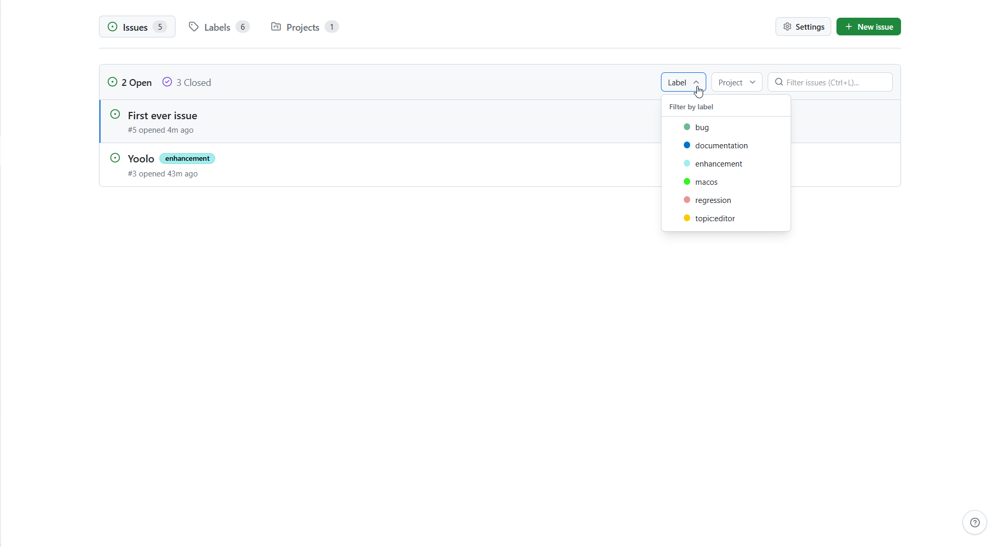
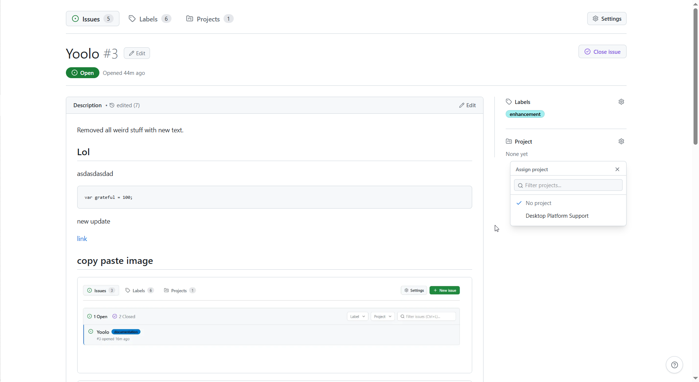
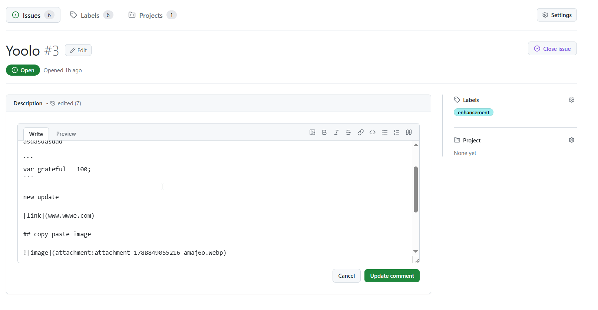
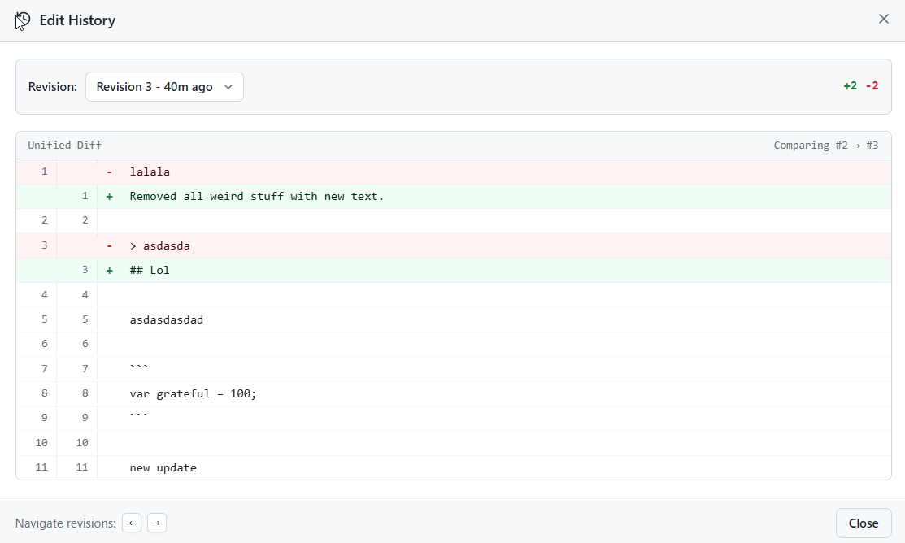
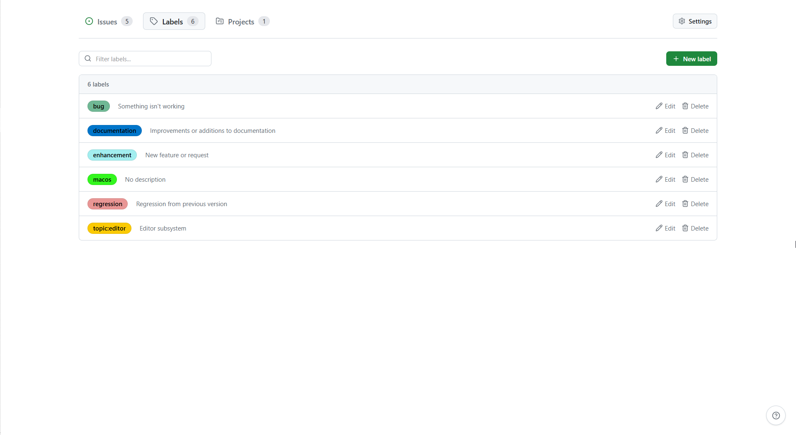

<div align="center">

# `Local Git Issues 📝`

[](#)
[](LICENSE)

An offline, lightweight desktop issue tracker with a GitHub-inspired workflow, Markdown editing/shortcuts, and local SQLite storage.

</div>

## Screenshots

| Issues List & Filters | Issue Detail & Markdown Editor |
| :---: | :---: |
|  |   |
| **Timeline & Edit History** | **Labels** |
|   |  |

## Features

- **Offline & Local-First**: all data is saved directly to a local SQLite database.
- **GitHub-Inspired UI**: familiar issue management with labels, projects, open/closed filters, and search.
- **Image Pasting**: paste screenshots directly via `Ctrl + V` or upload from disk. Compressed to WebP and stored locally.
- **Automated Storage Cleanup**: background garbage collection runs every hour and on startup to purge orphaned attachment files from disk.
- **Markdown Editor**: typical markdown workflow, syntax toolbar, and standard editing shortcuts.
- **Autostart (optional)**: run at Windows startup and minimize directly to system tray.
- **Keyboard-First Workflow**: fast navigation, quick-close shortcuts, and fuzzy search access.

## Lacking features (as for now, out of the box)

- repository linking
- collaboration
- cloud sync

## Download/Install

1. Navigate to [Releases](https://github.com/animgraphlabgames/Local-Git-Issues/releases) page.
2. Select latest release.
3. Download portable `.exe` file and run.


## Shortcuts

| Shortcut | Action |
| :--- | :--- |
| `Ctrl + N` | Create new issue |
| `Ctrl + K` | Close / Reopen current issue |
| `Ctrl + L` | Focus issue search bar |
| `Ctrl + ,` | Open Settings |
| `Tab` | Toggle Open / Closed issues tab |
| `↑ / ↓` | Navigate issues in list |
| `Enter` | Open highlighted issue |
| `Ctrl + /` | Toggle keyboard shortcuts help |
| `Esc` | Close / Back to list |

## Development

### Prerequisites

Install Node.js, Rust, and pnpm via `winget`:

```powershell
winget install OpenJS.NodeJS.LTS Rustlang.Rustup pnpm.pnpm
```

### Run in Development
```bash
pnpm install
pnpm dev
```

### Build for Windows
```bash
pnpm build:win
```

The portable `.exe` file will be created at: `src-tauri/target/release/local-git-issues.exe`

## License

MIT